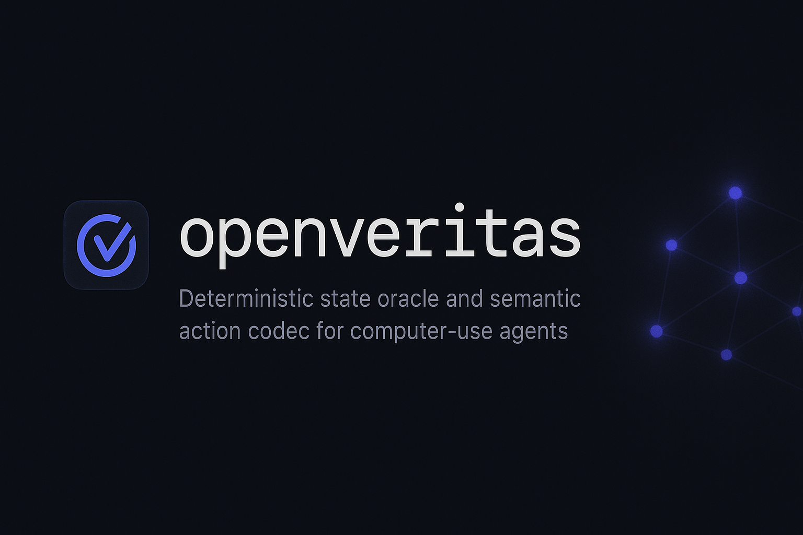
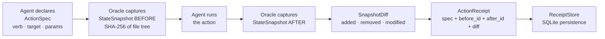

# groundcrew

**Deterministic state oracle and semantic action codec for computer-use agents.**



[](https://github.com/sandeep-alluru/groundcrew/actions/workflows/ci.yml)
[](https://pypi.org/project/groundcrew/)
[](https://pypi.org/project/groundcrew/)
[](https://pypi.org/project/groundcrew/)
[](LICENSE)
[](https://codecov.io/gh/sandeep-alluru/groundcrew)
[](https://mypy-lang.org/)

[Quick Start](#quick-start) · [How It Works](#how-it-works) · [CLI Reference](#cli-reference) · [GitHub Action](#github-action) · [vs. Alternatives](#vs-alternatives) · [Contributing](CONTRIBUTING.md)

---

## Why

Computer-use agents act on real software: they write files, call APIs, run scripts. But how do you know what they *actually* did vs. what they were *supposed* to do?

Screenshot-based LLM judges give you a visual approximation at best. They miss side effects — the extra file written, the config silently overwritten, the database row changed. And they cannot replay, diff, or audit what happened.

groundcrew inverts the architecture: instead of watching from the outside, it snapshots the filesystem **before and after every action** and produces a content-addressed **ActionReceipt** — a tamper-evident record of exactly what changed. No guessing. No LLM judge. Just a deterministic diff.

```
groundcrew capture --root . --verb write --target config.json --run "agent.py"
# → ActionReceipt: 3 files added, 1 modified, diff stored in .groundcrew/receipts.db
```

---

## How It Works



**Core primitives:**

- **FileState** — a content-addressed snapshot of a single file: path, size, SHA-256.
- **StateSnapshot** — a content-addressed snapshot of a directory tree. ID = SHA-256[:16] of sorted file states.
- **SnapshotDiff** — the structural delta between two snapshots: added, removed, modified files.
- **ActionSpec** — a semantic, content-addressed action description: `(verb, target, params)`. ID = SHA-256[:16] of the spec. The same action on the same target always produces the same ID.
- **ActionReceipt** — binds an ActionSpec to a before-snapshot ID, after-snapshot ID, and SnapshotDiff. Stored permanently as an audit trail.
- **ReceiptStore** — SQLite-backed store. Save receipts, retrieve by ID, list history.

Snapshots are computed by walking the directory tree with `os.walk`, hashing each file with SHA-256, and content-addressing the whole collection. This is purely Python standard-library code — no kernel hooks, no elevated privileges, no platform-specific APIs required.

---

## Features

| Feature | Details |
|---------|---------|
| Content-addressed snapshots | Same file tree always produces the same snapshot ID |
| Deterministic diffs | Added, removed, and modified files — no approximation |
| Semantic action codec | `ActionSpec` is portable, content-addressed, version-robust |
| Tamper-evident receipts | `ActionReceipt` binds intent to effect, stored permanently |
| SQLite receipt store | Single-file persistence, no server, works offline |
| Rich terminal output | Color diff tables, receipt summaries |
| JSON output | Machine-readable for downstream automation |
| Markdown output | Ready-to-paste audit reports |
| FastAPI REST server | `/capture`, `/receipt/{id}`, `/receipts`, `/diff/{id}` |
| MCP server | Model Context Protocol integration for Claude and other agents |
| 69 tests | Comprehensive test suite covering all layers |

---

## Quick Start

```bash
pip install groundcrew            # core library + CLI
pip install "groundcrew[api]"     # + FastAPI REST server
pip install "groundcrew[mcp]"     # + MCP server
```

```python
from groundcrew import Oracle, ActionSpec, ReceiptStore

# Declare what you're about to do
spec = ActionSpec(verb="write", target="config.json", params={"key": "value"})

# Capture before/after state around the action
with Oracle(".", spec) as oracle:
    import json, pathlib
    pathlib.Path("config.json").write_text(json.dumps({"key": "value"}))

receipt = oracle.record(spec)
print(receipt.diff.changed_paths)   # {'config.json'}
print(receipt.id)                   # content-addressed ID

# Persist for auditing
store = ReceiptStore(".groundcrew/receipts.db")
store.save(receipt)
```

---

## CLI Reference

```bash
groundcrew [--db PATH] COMMAND [OPTIONS]
```

| Command | Description | Key options |
|---------|-------------|-------------|
| `capture` | Snapshot before/after a shell command | `--root DIR`, `--verb VERB`, `--target TARGET`, `--run CMD` |
| `diff RECEIPT_ID` | Show the SnapshotDiff for a stored receipt | — |
| `log` | List all stored receipts | — |
| `status` | Show database info | — |

**Global options:**

| Option | Default | Env var |
|--------|---------|---------|
| `--db PATH` | `.groundcrew/receipts.db` | `GROUNDCREW_DB` |

**Examples:**

```bash
# Capture what an agent script does to the current directory
groundcrew capture --root . --verb run --target agent.py --run "python agent.py"

# Show what changed
groundcrew diff abc123de

# List all receipts
groundcrew log

# Status
groundcrew status
```

---

## GitHub Action

Add groundcrew auditing to your CI pipeline:

```yaml
# .github/workflows/groundcrew.yml
name: groundcrew audit
on: [push, pull_request]

jobs:
  audit:
    runs-on: ubuntu-latest
    steps:
      - uses: actions/checkout@v4
      - uses: sandeep-alluru/groundcrew@main
        with:
          root: .
          db: .groundcrew/receipts.db
```

---

## vs. Alternatives

| | groundcrew | Screenshot judges | AgentSight | OSWorld verifiers |
|---|---|---|---|---|
| **Verification method** | Filesystem diff | Vision LLM | eBPF syscall trace | Per-task custom code |
| **Deterministic** | Yes — content-addressed | No — probabilistic | Partial | Yes (per app) |
| **No per-app code** | Yes | Yes | Yes | No — 33 apps manually |
| **Production runtime** | Yes | Yes | Linux-only | VM/sandbox only |
| **Audit trail** | SQLite receipts | None | Log files | None |
| **Action codec** | Portable ActionSpec | None | None | None |
| **Open source** | MIT | N/A | MIT | Research |
| **Python package** | Yes | N/A | No | No |

groundcrew is not a replacement for security-layer tools like AgentSight. It is specifically designed for agent developers who need a simple, deterministic record of what their agent changed on disk — suitable for testing, auditing, and CI/CD gating.

---

## Claude / MCP integration

groundcrew ships a Model Context Protocol server that lets Claude and other MCP-compatible agents record and query action receipts directly:

```bash
# Start the MCP server
python -m groundcrew.mcp_server

# In your Claude Code project's .claude/settings.json:
{
  "mcpServers": {
    "groundcrew": {
      "command": "python",
      "args": ["-m", "groundcrew.mcp_server"]
    }
  }
}
```

Once connected, Claude can call `groundcrew/capture_state`, `groundcrew/get_receipt`, and `groundcrew/list_receipts` as tools. See [docs/mcp.md](docs/mcp.md) for the full tool schema.

---

## OpenAI integration

groundcrew exposes a FastAPI REST server compatible with OpenAI's function-calling format. The tool definitions are in [`tools/openai-tools.json`](tools/openai-tools.json) and the full API spec is in [`openapi.yaml`](openapi.yaml).

```bash
# Start the REST server
uvicorn groundcrew.api:app --reload

# Pass to Codex CLI or any OpenAI-compatible agent
codex --tools tools/openai-tools.json "Capture what this script does to the filesystem"
```

Endpoints: `GET /health`, `POST /capture`, `GET /receipt/{id}`, `GET /receipts`, `GET /diff/{id}`. See [docs/openai.md](docs/openai.md) for details.

---

## Repository structure

```
groundcrew/
├── src/
│   └── groundcrew/
│       ├── snapshot.py       # FileState, StateSnapshot, SnapshotDiff
│       ├── codec.py          # ActionSpec, ActionReceipt (content-addressed)
│       ├── oracle.py         # Oracle context manager, capture(), ReceiptStore
│       ├── report.py         # print_receipt(), print_diff(), to_json(), to_markdown()
│       ├── cli.py            # Click CLI (capture, diff, log, status)
│       ├── api.py            # FastAPI REST server
│       └── mcp_server.py     # MCP server
├── tests/
│   ├── test_snapshot.py      # StateSnapshot, SnapshotDiff unit tests
│   ├── test_codec.py         # ActionSpec, ActionReceipt unit tests
│   ├── test_oracle.py        # Oracle context manager, ReceiptStore tests
│   ├── test_report.py        # Formatter tests
│   ├── test_cli.py           # CLI subprocess integration tests
│   ├── test_cli_runner.py    # Click CliRunner tests
│   └── test_api.py           # FastAPI TestClient tests
├── examples/
│   └── demo.py               # Standalone demo script
├── docs/                     # MkDocs documentation
├── tools/
│   └── openai-tools.json     # OpenAI function-calling tool definitions
├── assets/
│   ├── hero.png              # README hero image
│   └── logo.png              # Project logo
├── action.yml                # GitHub Action
├── openapi.yaml              # OpenAPI 3.1 spec
├── pyproject.toml            # Package metadata + dependencies
└── CONTRIBUTING.md           # Contribution guide
```

---

## GitHub Topics

Suggested topics for discoverability:

`ai-agents` `computer-use` `state-oracle` `action-codec` `filesystem-diff` `verification` `observability` `mcp` `openai` `llm-tools` `audit-trail` `ci-cd` `python`

---

[](https://star-history.com/#sandeep-alluru/groundcrew&Date)
